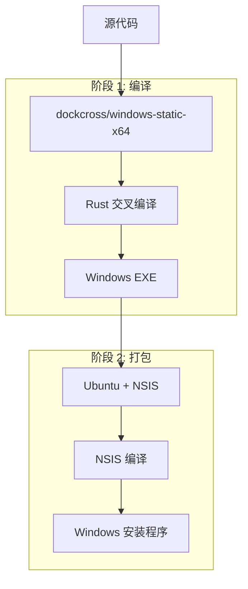

# Wallpaper Explorer - Windows 安装程序构建指南

本指南说明如何使用 [dockcross](https://github.com/dockcross/dockcross) 和 NSIS 构建专业的 Windows 安装程序。

## 📋 目录

- [系统要求](#系统要求)
- [快速开始](#快速开始)
- [构建流程](#构建流程)
- [自定义配置](#自定义配置)
- [安装程序特性](#安装程序特性)
- [故障排除](#故障排除)
- [技术细节](#技术细节)

## 🎯 系统要求

### 开发环境
- **操作系统**: macOS, Linux, Windows (with WSL2)
- **Docker**: 20.10+ with BuildKit support
- **内存**: 至少 4GB 可用内存
- **磁盘空间**: 至少 2GB 可用空间

### 目标系统
- **Windows**: 10 或更高版本
- **架构**: x86_64 (64位)
- **权限**: 管理员权限（用于安装）

## 🚀 快速开始

### 方法 1: 使用构建脚本（推荐）

```bash
# 克隆项目
git clone <repository-url>
cd Wallpaper-Explorer

# 运行构建脚本
./scripts/build-installer.sh
```

### 方法 2: 使用 Docker Compose

```bash
# 构建安装程序
docker-compose up windows-installer

# 或者使用 BuildKit
DOCKER_BUILDKIT=1 docker-compose up windows-installer
```

### 方法 3: 手动 Docker 构建

```bash
# 构建镜像
docker build -t wallpaper-installer .

# 运行构建
docker run --name builder wallpaper-installer

# 复制结果
docker cp builder:/app/dist ./dist
```

## 🔄 构建流程

我们的构建系统使用两阶段 Docker 构建：



### 详细步骤

1. **环境准备**
   - 拉取 `dockcross/windows-static-x64` 镜像
   - 设置交叉编译环境

2. **代码编译**
   - 使用 Rust 交叉编译器
   - 生成 Windows x86_64 可执行文件
   - 静态链接 MinGW-w64

3. **资源准备**
   - 复制应用程序文件
   - 复制资源文件（字体、图标等）
   - 生成许可证文件

4. **安装程序创建**
   - 使用 NSIS 3.x 编译器
   - 应用现代化 UI 主题
   - 集成多语言支持

5. **输出验证**
   - 检查文件完整性
   - 生成构建报告

## ⚙️ 自定义配置

### 修改应用程序信息

编辑 `Dockerfile` 中的 NSIS 脚本部分：

```nsis
!define APP_NAME "您的应用名称"
!define APP_VERSION "1.0.0"
!define APP_PUBLISHER "您的公司名称"
!define APP_URL "https://your-website.com"
!define APP_DESCRIPTION "应用程序描述"
```

### 添加自定义图标

1. 将图标文件（.ico）放在 `assets/icons/` 目录
2. 更新 NSIS 脚本中的图标路径：

```nsis
!define MUI_ICON "assets\icons\app.ico"
!define MUI_UNICON "assets\icons\uninstall.ico"
```

### 配置安装选项

在 NSIS 脚本中添加新的安装组件：

```nsis
Section "可选组件" SecOptional
    ; 安装可选文件
    SetOutPath "$INSTDIR\optional"
    File /r "optional\*.*"
SectionEnd
```

## ✨ 安装程序特性

### 🎨 现代化界面
- 使用 Modern UI 2 主题
- 支持高 DPI 显示
- 自定义品牌图标和横幅

### 🌍 多语言支持
- 简体中文
- 英语
- 可轻松添加其他语言

### 🔧 智能安装
- 自动检测已安装版本
- 支持静默安装
- 管理员权限检查

### 📁 文件管理
- 智能文件覆盖
- 资源文件部署
- 注册表集成

### 🔗 快捷方式
- 桌面快捷方式（可选）
- 开始菜单文件夹
- 快速启动选项

### 🗑️ 完整卸载
- 清理所有安装文件
- 删除注册表项
- 移除快捷方式

## 🛠️ 故障排除

### 常见问题

#### 1. Docker 构建失败

```bash
# 检查 Docker 版本
docker version

# 启用 BuildKit
export DOCKER_BUILDKIT=1

# 清理 Docker 缓存
docker system prune -a
```

#### 2. 交叉编译错误

```bash
# 验证 dockcross 镜像
docker pull dockcross/windows-static-x64:latest

# 检查目标架构
docker run dockcross/windows-static-x64 uname -m
```

#### 3. NSIS 编译失败

```bash
# 检查 NSIS 脚本语法
docker run --rm -v $(pwd):/src ubuntu:22.04 bash -c "
  apt-get update && apt-get install -y nsis
  makensis /src/installer.nsi
"
```

#### 4. 权限问题

```bash
# 修复文件权限
sudo chmod -R 755 dist/
sudo chown -R $USER:$USER dist/
```

### 调试模式

启用详细输出：

```bash
# 设置调试环境变量
export DOCKER_BUILDKIT_PROGRESS=plain
export BUILDKIT_PROGRESS=plain

# 运行构建
./scripts/build-installer.sh
```

## 🔧 技术细节

### 使用的技术栈

| 组件 | 版本 | 用途 |
|------|------|------|
| dockcross/windows-static-x64 | latest | 交叉编译环境 |
| Rust | 1.83+ | 应用程序开发 |
| MinGW-w64 | 内置 | Windows 工具链 |
| NSIS | 3.x | 安装程序创建 |
| Ubuntu | 22.04 | 构建环境 |

### 构建产物

```
dist/
├── Wallpaper-Explorer-Setup-v0.1.0.exe  # Windows 安装程序
└── INSTALLER_INFO.txt                    # 构建信息
```

### 性能优化

1. **Docker 层缓存**: 优化 Dockerfile 层顺序
2. **Cargo 缓存**: 缓存 Rust 依赖项
3. **并行构建**: 利用多核 CPU
4. **静态链接**: 减少运行时依赖

### 安全考虑

1. **代码签名**: 建议为发布版本添加数字签名
2. **权限最小化**: 使用只读文件系统
3. **依赖验证**: 验证所有外部依赖
4. **扫描**: 使用 antivirus 扫描最终文件

## 📝 许可证

本项目使用 MIT 许可证。详见 [LICENSE](../LICENSE) 文件。

## 🤝 贡献

欢迎提交 Issue 和 Pull Request！

## 📞 支持

如有问题，请：

1. 查看本指南的故障排除部分
2. 搜索已知问题
3. 创建新的 GitHub Issue

---

*最后更新: 2025-01-06* 